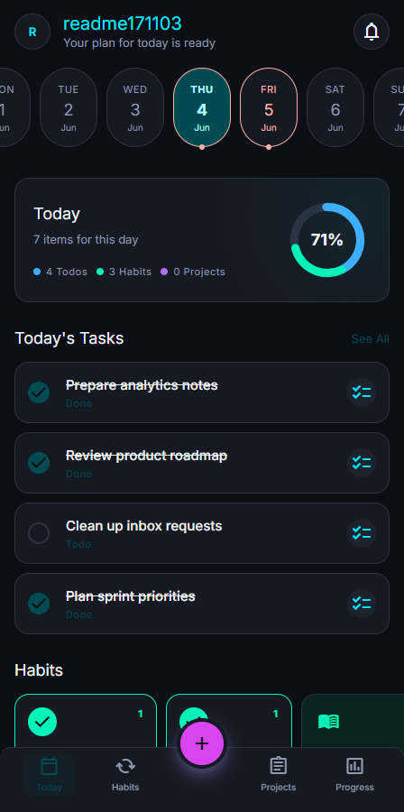
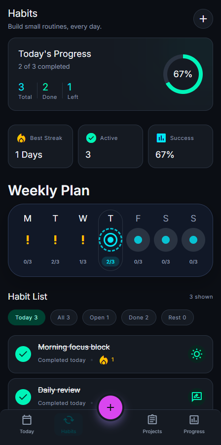
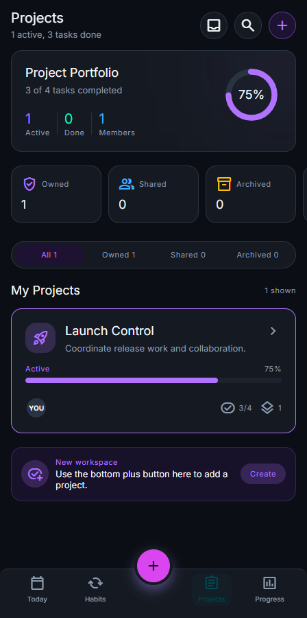
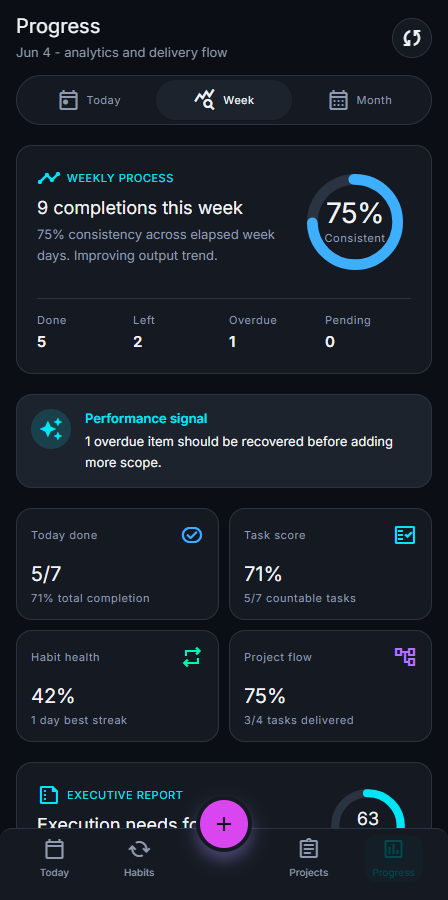
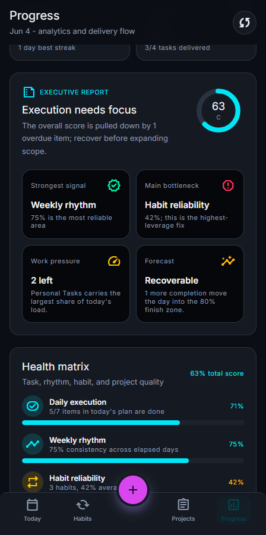
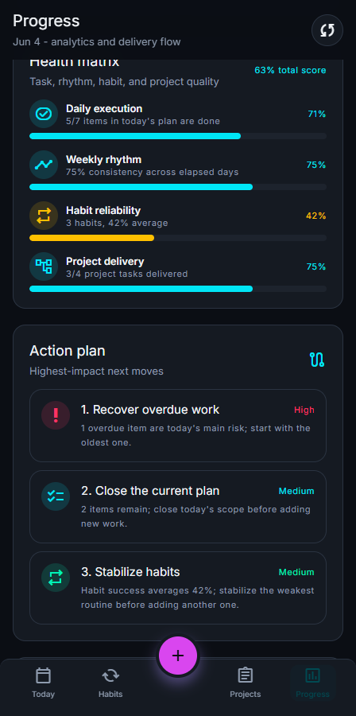
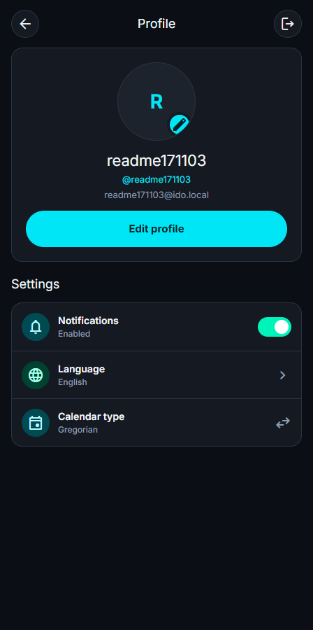

# IDo

IDo is a mobile-first execution workspace for people who want one place to plan the day, track habits, manage project work, and understand progress without switching between disconnected tools. It is built around daily execution: what needs attention today, what is already moving, what is blocked, and what should happen next.

It combines personal tasks, recurring routines, collaborative projects, progress analytics, and profile settings into a focused app experience designed for fast everyday use.

## Today

<table>
  <tr>
    <td width="58%" valign="top">
      <h3>Daily execution hub</h3>
      
The Today screen is the main place to start work. It brings together today's tasks, active habits, project work, pending requests, and a clear completion ring so the user can understand the day at a glance.

      
It is designed for quick scanning: the selected date stays visible, completed items are clearly marked, and each item can open into its own detail view when more context is needed.

    </td>
    <td width="42%" align="center">
      
    </td>
  </tr>
</table>

## Habits

<table>
  <tr>
    <td width="42%" align="center">
      
    </td>
    <td width="58%" valign="top">
      <h3>Routines that stay measurable</h3>
      
Habits help users build repeatable routines without mixing them into ordinary tasks. The screen shows today's habit progress, best streak, active routines, weekly activity, and the current status of each habit.

      
Each routine can have its own color, icon, active days, streaks, and completion state, making habit tracking feel lightweight but still useful for long-term consistency.

    </td>
  </tr>
</table>

## Projects

<table>
  <tr>
    <td width="58%" valign="top">
      <h3>Project work with visible delivery</h3>
      
Projects organize larger work into shared spaces with progress, members, sections, and project tasks. Each project can have its own identity, status, task count, completion percentage, and collaboration context.

      
The portfolio view makes it easy to separate owned, shared, and archived work while keeping delivery progress visible for every active workspace.

    </td>
    <td width="42%" align="center">
      
    </td>
  </tr>
</table>

## Progress Report

<table>
  <tr>
    <td width="42%" align="center">
      
    </td>
    <td width="58%" valign="top">
      <h3>Clean analytics for real decisions</h3>
      
The Progress page turns raw activity into a readable report. It shows weekly consistency, daily completion, task score, habit health, project flow, overdue work, and the main performance signal for the current plan.

      
The report is not just decorative. It highlights risk, shows where the work is moving well, and makes the current state of execution easy to understand.

    </td>
  </tr>
</table>

## Insights

<table>
  <tr>
    <td width="58%" valign="top">
      <h3>Executive summary and health matrix</h3>
      
IDo includes an executive-style report that gives the day a score, identifies the strongest signal, detects the main bottleneck, estimates work pressure, and forecasts whether the current plan is recoverable.

      
The health matrix compares daily execution, weekly rhythm, habit reliability, and project delivery so the user can see which part of the system deserves attention first.

    </td>
    <td width="42%" align="center">
      
    </td>
  </tr>
</table>

## Action Plan

<table>
  <tr>
    <td width="42%" align="center">
      
    </td>
    <td width="58%" valign="top">
      <h3>Next steps, not just numbers</h3>
      
The action plan translates the report into practical next moves. It can call out overdue work, unfinished scope, weak habit reliability, project delivery risk, or pending collaboration requests.

      
Each recommendation is ranked by impact, helping the user focus on the next useful action instead of reading charts without a clear decision.

    </td>
  </tr>
</table>

## Profile And Settings

<table>
  <tr>
    <td width="58%" valign="top">
      <h3>Simple account controls</h3>
      
The profile screen keeps account details and essential settings in one clean place. Users can update their profile, upload an avatar, toggle notifications, change language, and switch calendar type.

      
Extra settings were intentionally removed so the screen stays focused on controls that matter in daily use.

    </td>
    <td width="42%" align="center">
      
    </td>
  </tr>
</table>

---

Made with 🤍 by Azadiyan

